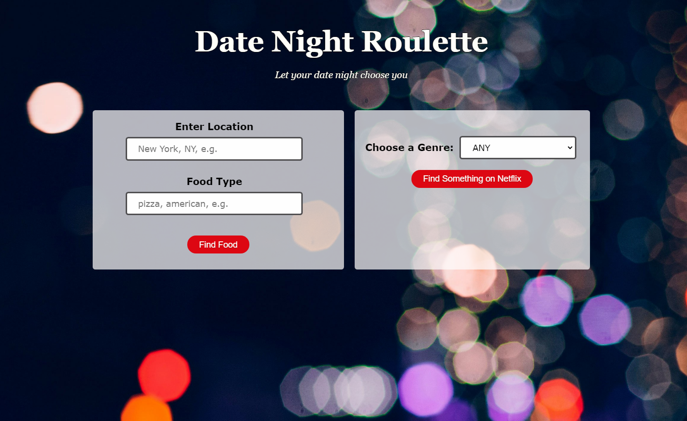
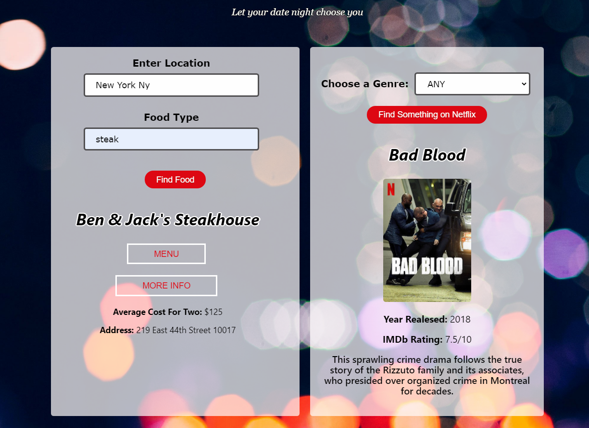

<head>
    <h1><b>Date Night Roulette</b><h1>
    
A randomization application that takes the stress of picking dinner and a movie off the user.
</head>

 

    <h3>Demo</h3>
    
<a href="https://ilarocca.github.io/Date-Night-Roulette/ ">Live Demo

 

    <h3>Screenshots</h3>
    
    

    <h3>About</h3>
    
Lets you randomly choose a restaurant based on your location and food type keyword. Lets you randomly select a netflix result with the option of including a major genre choice.

    <h3>Built With</h3>
    <ul>
        <li>JavaScript</li>
        <li>jQuery</li>
        <li>JSON</li>
        <li>HTML</li>
        <li>CSS</li>
    </ul>

